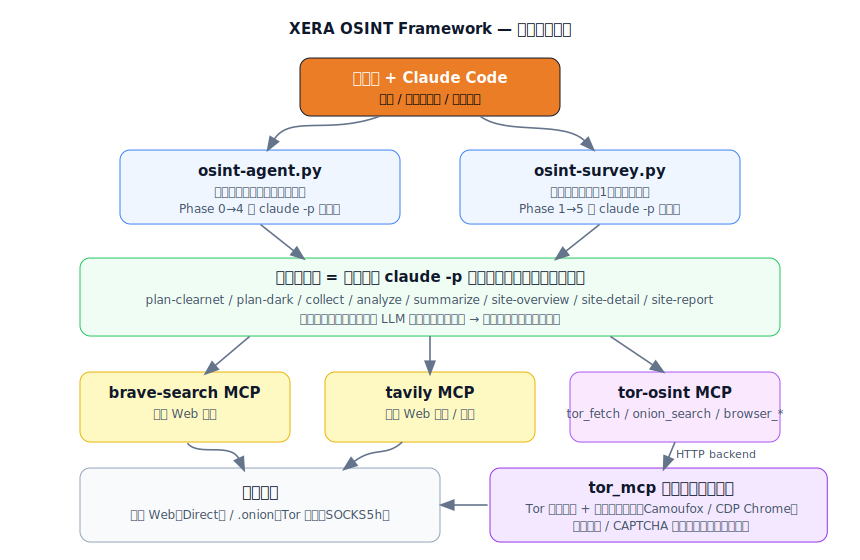
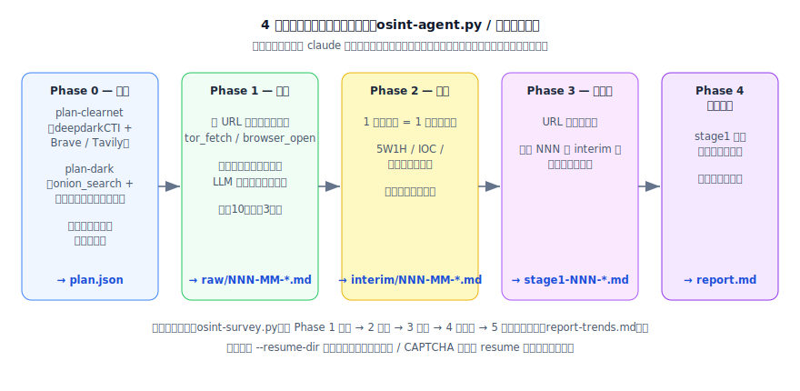

# XERA OSINT Framework

## 機能概要

Claude Code を頭脳に、**公開情報（表層 Web）とダークウェブ（.onion）を横断して受動的に OSINT 調査を自動化**するフレームワーク。  
自然言語クエリ 1 行、またはサイト URL 1 つを起点に、計画→収集→解析→まとめ→レポートまでを複数の AI セッションに分割して実行する。  



> **倫理スコープ**: 本フレームワークは**受動的な情報収集（閲覧・公開テキストの収集）**に限定します。
> 不正アクセス・違法コンテンツの取得や取引・能動的攻撃には使用しないでください。
> 詳細は [倫理・法的方針](#倫理法的方針重要) を参照。

---

## 特徴

- **2 つのオーケストレーター** — テーマで横断調査する `osint-agent.py` と、1 サイトを棚卸しする `osint-survey.py`
- **マルチエージェント・パイプライン** — 各フェーズを独立した `claude -p` セッションに分け、本文はファイルに保存し LLM にはメタデータのみ返すことでコンテキスト肥大を抑える
- **表層 + 暗層の統合** — Brave / Tavily（表層検索）と Tor 経由の `onion_search` / ブラウザ操作（暗層）を 1 つの計画に統合する
- **共有バックエンド** — Tor とブラウザを常駐プロセスで共有し、ログイン / CAPTCHA 状態を全プロセス間で引き継ぐ（[tor_mcp](tor_mcp/README.md)）
- **途中再開** — `--resume-dir` で完了済みフェーズを自動スキップして再開できる
- **人間 resume 方式** — ログイン壁・CAPTCHA はヘッドフルなブラウザ画面で人が解決し、Enter を押すと同じセッションが文脈を保ったまま再開する
- **ローカル LLM 対応** — `--lm-studio` で LM Studio（OpenAI 互換）に切り替え可能

---

## アーキテクチャ

| レイヤ | 役割 |
|--------|------|
| オーケストレーター | `osint-agent.py` / `osint-survey.py` がフェーズを `claude -p` で順に起動 |
| スキル | 各フェーズの振る舞いを定義（plan / collect / analyze / summarize / site-*） |
| MCP サーバ | `tor-osint`（Tor + ブラウザ）, `brave-search`, `tavily` |
| 共有バックエンド | `tor_mcp` が Tor プロセスと常駐ブラウザ（Camoufox / CDP Chrome）を管理 |
| 調査対象 | 表層 Web（Direct）/ .onion（Tor 経由・SOCKS5h） |

---

## パイプライン



### A. クエリ駆動・横断調査（`osint-agent.py`）

```
Phase 0  計画    クエリ → 表層(Brave/Tavily)+暗層(onion_search/フォーラム)を統合 → plan.json
Phase 1  収集    各URLをブラウザ操作で生データ保存          → raw/NNN-MM-*.md（本文はファイルへ）
Phase 2  解析    各 raw を 5W1H/IOC で意味判定・構造化       → interim/NNN-MM-*.md（1ファイル1セッション）
Phase 3  まとめ  URLごとに interim を集約                    → stage1-NNN-*.md
Phase 4  レポート stage1 群を横断してクエリへ回答            → report.md
```

### B. サイト棚卸し調査（`osint-survey.py`）

```
Phase 1  概要(計画) トップページから一覧・統計を抽出   → stage1-overview.md, stage1-urls.json
Phase 2  収集      各URLをブラウザ操作で保存            → raw/NNN-MM-*.md
Phase 3  解析      各 raw を意味判定・構造化            → interim/NNN-MM-*.md
Phase 4  まとめ    URLごとに interim を集約             → stage2-NNN-*.md
Phase 5  レポート  overview + stage2 を横断             → report-trends.md
```

> 収集フェーズでは、ツールが本文をファイルに保存し LLM にはメタ（パス / タイトル /
> リンク / プレビュー）だけを返す。複数画面を巡回してもコンテキストが肥大しない。

---

## セットアップ

### 1. 依存パッケージ

```bash
# Playwright のバンドルブラウザはダウンロードしない（システムブラウザ + Camoufox を使う）
export PLAYWRIGHT_SKIP_BROWSER_DOWNLOAD=1   # PowerShell: $env:PLAYWRIGHT_SKIP_BROWSER_DOWNLOAD=1
uv pip install -r tor_mcp/requirements.txt

# Camoufox（アンチフィンガープリント Firefox）本体を取得
uv run python -m camoufox fetch
```

### 2. Tor 本体（Tor Expert Bundle）の配置

バイナリはリポジトリに含めない。各自で配置する。

- 取得: <https://www.torproject.org/download/tor/> → **Windows Expert Bundle**
- 配置: 展開した `tor` フォルダの中身を `tor_mcp/vendor/tor/` へ（`tor_mcp/vendor/tor/tor.exe` になるように）
- 確認: `uv run python -m tor_mcp.tor_process --check-binary`

詳細は [tor_mcp/README.md](tor_mcp/README.md) を参照。

### 3. API キー

表層検索の MCP サーバ（Brave / Tavily）は `.env` から API キーを読む。

```bash
cp .env.example .env
# .env を編集して BRAVE_API_KEY / TAVILY_API_KEY を設定
```

### 4. MCP サーバ

[.mcp.json](.mcp.json) に `tor-osint` / `brave-search` / `tavily` が定義済み。
このディレクトリで Claude Code を起動すると認識される。

---

## 使い方

```bash
# A) テーマで横断調査
uv run python osint-agent.py --query "Clopランサムウェアについて調査してほしい"

# B) まず計画だけ確認 → plan.json を吟味してから続行
uv run python osint-agent.py --query "..." --plan-only

# C) 1 サイトを棚卸し
uv run python osint-survey.py --site breached-su --url https://breached.su

# D) 中断した調査を再開（完了分は自動スキップ）
uv run python osint-survey.py --site breached-su --resume-dir surveys/breached-su-XXXXXXXX
```

主なオプション（共通）:

| オプション | 説明 |
|---|---|
| `--resume-dir <dir>` | 既存ディレクトリで再開（各フェーズの既存ファイルは自動スキップ） |
| `--plan-only` | 計画 / 概要だけ作る |
| `--no-report` | レポート手前まで実行 |
| `--lm-studio` / `--lm-model` | ローカル LLM（LM Studio）で実行 |

> 全オプション・途中再開チートシート・トラブルシューティングは [USAGE.md](USAGE.md) を参照。

---

## ログイン・CAPTCHA への対応（resume 方式）

ブラウザは共有バックエンドに常駐するため、Claude が一度終了してもログイン状態は保たれる。

```
1. Claude がログイン/CAPTCHA を検出 → 即終了（待機しない）
2. オーケストレーターが一時停止し、対象 URL を表示
3. あなたがヘッドフルのブラウザ画面でログイン or CAPTCHA を解決
4. ターミナルに戻って Enter
5. 同じセッションが文脈を復元して調査を再開
```

- **待つ必要なし** — 解決して Enter を押すまで処理は止まって待つ（タイムアウトしない）。
- **パスワードは会話・ターミナルに貼らない** — 必ずブラウザ画面で入力する。
- 事前に対話モードでログインを済ませておくと、本番でログイン壁に当たらない。

---

## ディレクトリ構成

| パス | 内容 |
|------|------|
| `osint-agent.py` | クエリ駆動オーケストレーター |
| `osint-survey.py` | サイト棚卸しオーケストレーター |
| `browse_cli.py` | ブラウザ手動操作 CLI（共有バックエンドに相乗り） |
| `tor_mcp/` | Tor 接続 MCP サーバ + 共有バックエンド（[README](tor_mcp/README.md)） |
| `deepdarkCTI/` | 計画フェーズが参照する CTI ヒント集 |
| `surveys/` | 調査ごとの出力（raw / interim / stage / report） |
| `USAGE.md` | 詳細な使い方ガイド |

---

## トラブルシューティング（抜粋）

| 症状 | 対処 |
|---|---|
| 日本語出力が文字化け | `PYTHONUTF8=1` を付けて実行 |
| tor_mcp ポート競合 (`Address already in use`) | 孤立 `tor.exe` を `taskkill`（Tor Browser の 9150/9151 は落とさない） |
| ログイン壁 / CAPTCHA で止まる | 上記 resume 方式で解決して Enter（正常動作） |
| バックエンドが応答しない | `tor_mcp/vendor/backend.log` を確認 |

詳細は [USAGE.md](USAGE.md) のトラブルシューティング節を参照。

---

## 倫理・法的方針（重要）

- **受動的な情報収集（閲覧・公開テキストの収集）に限定**する。
- 不正アクセス、違法コンテンツの取得・取引、能動的攻撃には使用しない。
- `onion_search` の結果には未審査・違法な掲載が含まれ得る。**結果は調査者が評価する前提**であり、ツールは内容の合法性を保証しない。
- ログインは**自分が認可されたアカウント**でのみ行う。認証回避は行わない。
- 調査は認可された範囲で、各国法令・所属組織の規程に従って実施すること。

---

## 命名の由来 (Concept)
**XERA** = **X**-layer **E**xtraction & **R**econ **A**utonomous-pipeline  
**読み**: シエラ

- **Cross (Xross) layer extraction**: 表層Web（クリアネット）と深層Web（Tor）という、本来交わらない2つの「クロスネットワーク」を縦横無尽に行き来し、情報を抽出するシステム構造を表現した。
- **Sierra (鋸)**: 立ちはだかる膨大な情報の山を、ノコギリのように力強く切り開き、隠されたファクトを探索・抽出するという能力から命名しました。

## ライセンス

Copyright (c) 2026 segfo — MIT License（[LICENSE](LICENSE) 参照）。
